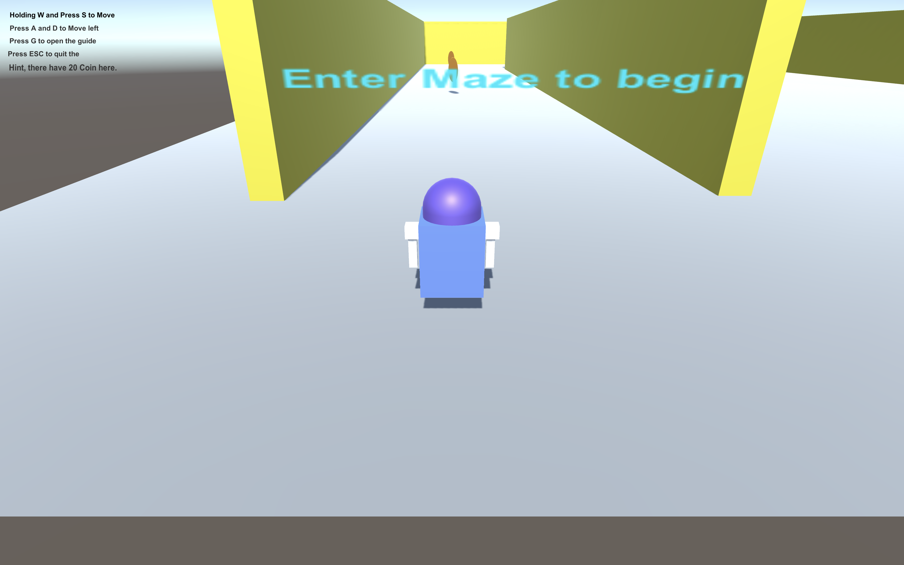
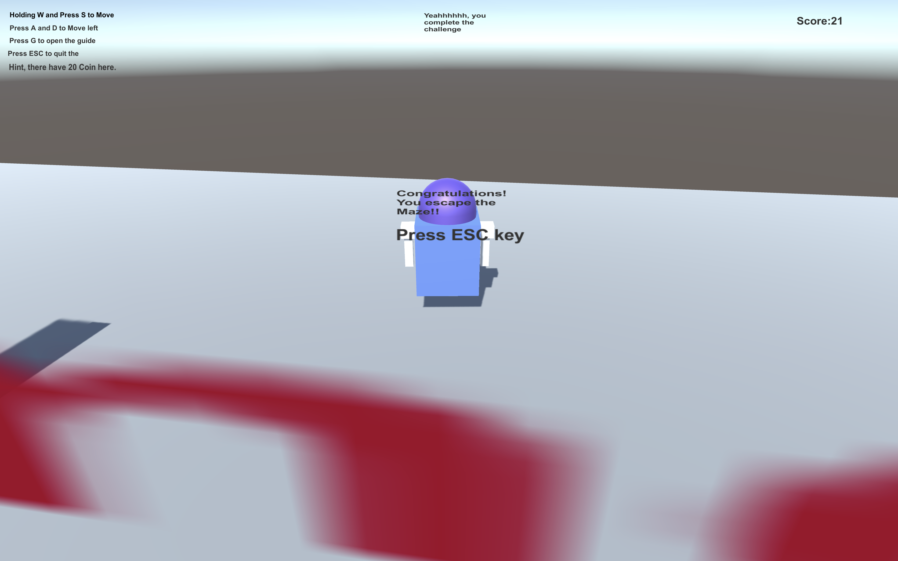
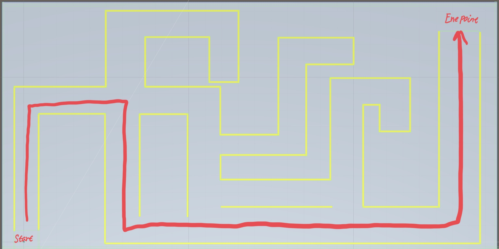

# Assignment 2 Escape the Maze:

## the functionality in my work:

1. **Move the character**: In my game, my character not only can move forward, back, left, right, but also it can rotate and move in different direction. Those function I implemented it in the `PlayController.cs.` Specifically, I used a `Vector2` to control character in x axis and y axis. In addition, I use `Mathf.tan2` to calculate the angle in each movement base on x axis and y axis input. Then, I use `Quaternion.euler` to store the rotation information in each movement and Quaternion.Slerp the calculate the rotation in each frame.

2. **Spring Following Camera:** The most of algorithm for Spring following camera I just follow the Algorithm from Chapter 8 Spring following section in the book "Sanjay Madhav. 2014. Game Programming Algorithms and Techniques. Addison-Wesley ." All the implementation located at the script `CameraSpring.cs`. Specifically, I calculate the forward direction and up direction for camera and then use this information to calculate the actual position. Then I make my camera alway lookat target from the actual position. In each frame, I based on the information of high distance and vertical distance from camera to target to calculate the ideal position. Then I calculate the actual position again. I use `Quaternion.LookRotation` to follow the character when it turn the different direction.

3. **`EndPointCollider` and edge check:** when the character enter the Maze, the Game begin. When the character hit the endpoint collider, the game end and a text will shown on screen. In addition, when character get out the maze, it will be lock on a specific area. The character will not move out of plane. All these function I implemented in BoxCollider for empty object. This function implemented in `EndPointCollider.cs`

4. `Guide mode:` For get out the maze as faster as you can, I create a guide, when you hit `G` bottom, part of the wall will show a red sign for guiding you to get out of the maze. This function implemented in `GameController.cs`.
	
5.  `Collection:` I create 21 coins in the maze, each time when character collide with coins, the coin will hide and the score shown on screen will add one. I made a special challenge in this game, when the user collect all the coin in the game(21), A text will shown on screen. This function implemented in `PlayerController.cs`

6. **Quit the game:** Press `Escape key `to quit the game for using `Application.Quit();`. This function implemented in "GameController.cs".

## Game Test

+ To control the character, **W/A/S/D** to move character **Forward/Turn right/Turn left/Back**. 
+ To quit the Game, Press `ESC` key  
+ To show the fast way to get out the maze, press `G` key. The wall will show on *red sign* to guide user.

### The fastest routine

 
	
	
