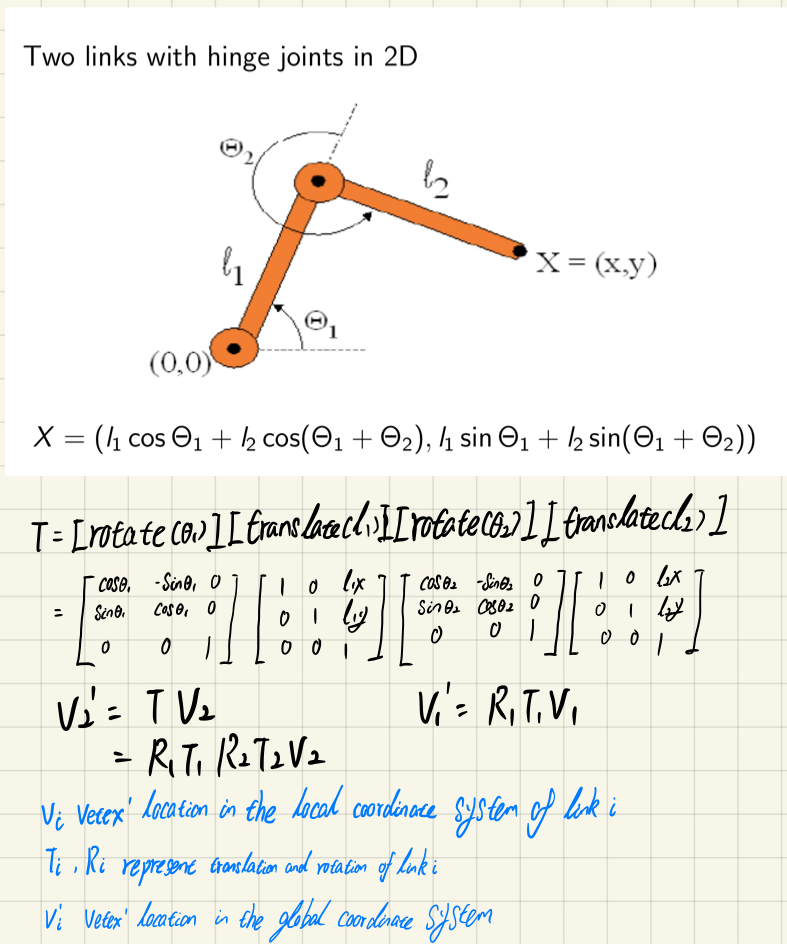
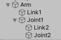

# Project 4 
###  This game to get familiar with the principle of forward kinematic and how to use it in Unity

### Basically, it should parent from the first joint and link to the second joint and link and so on. Then use the matrix multipication to compute the position and rotation of the child joint the links according to their parent.

  

## The function in this game:

1. **Forword Kinematic:** most code you can find  in the `BodyController.cs`. MeanWhile,  when the user press `n` key, the program will use matrix transfermation to compute the position for  the second joint  by using  the rotation and postion of joint1`(Call Arm in my game)` , joint2`(Call Joint1 in my game )` and the length of two Links. Similarly, when the user press `m` key, it will do the matrix transformation by using its inverse matrix to move the arm back.

2. **Moving and Rotate Crane:** Most code  you can find in `BodyController.cs`. Speciafically, press `w`,`a`,`s`,`d` to move the crane` forward, back, left,right.` Moverover, when the user  pressing `J` and `K` key , the crane will rotate  by Y axis to left and right direction

3. **Pick up and throw the pickup target:** In this game, the Joint3(`call Joint2 in my game`) can "stick or unstick" the pickup target(Green Coins) by pressing the `Space` key. Specifically, the joint3 can parent the pickup object to achieve the purpose of ''stick the object, where all the gravity and collision property will disabled during that time. However, when your pree the `Space` key again, the crane  will throw the pickup target , all the disabled property mentioned above will enable again, and the Joint3 will not as the parent of pickup target anymore. **Note that: the joint3 can pick up the coins only when the distance between them less than 0.5, so the user need to put down the arm(pressing `n` key) and close to the coins, then press the `Space` key to pick up the object and raising the arm by press `m` key**. All the code in this part you can find in `PickupAndThrow.cs`

4. **Get the score:**  Basically, I made a transparent collide box in the red target area. When the pickup targets collide with the target area, the score will increase by one. The code shows  in `ScoreArea.cs`

5. **GameManage:** In `GameManage.cs`, there are two mainly funcitons. One is for display the game instrutions and the remaining time in the game screen. The second is countdown the time. When the time goes up, I will use `Time.timeScale = 0.0f;` to end the game.

6. **Quit the game:** When you press the `ESC` key, the game will quit. The code you can find in `GameManage.cs`.

7. **Animation:**  I create in two moving walls in this game to make this game fun.

## Game Rules

In this Game, user will have 100 seconds to play the game, the target of this game is to control the crane to collect the coins into the red target area as much as you can. When time goes up, the game will end.

